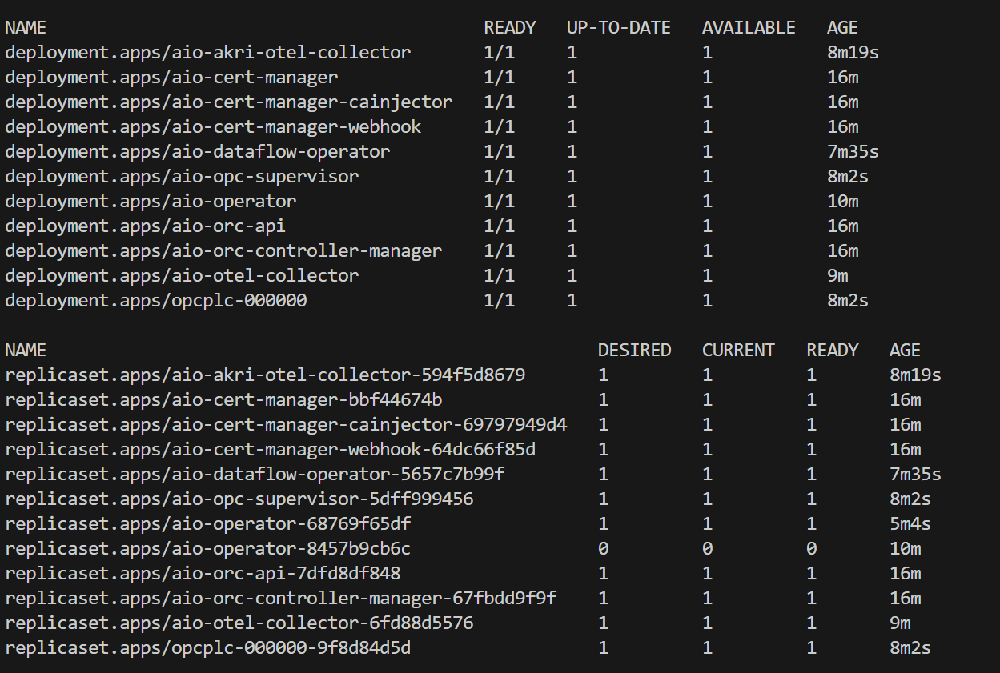
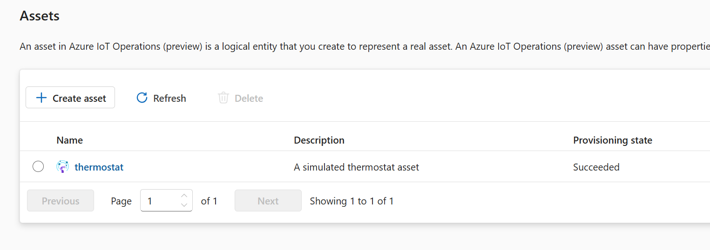

# IoT Operations Workshop

References:
- https://github.com/Azure-Samples/explore-iot-operations
- https://github.com/Azure/azure-iot-operations

## Lab 01. Create testing environment with AIO in cloud

If you need to create a testing environment using an AKS, arc-enabling AKS and then instal Azure IoT Operations on it, you can use the scripts provided. Create a copy of the file `config/settings.template.json` with the name `config/settings.json`, customize the settings and then you can use the following scripts:

```bash
cd lab01-setup-new-site

./site-create-01.sh -r iot-oper-08-rg -s aio-k8s-08

./prep-iot-operations-setup-02.sh -c ../config/settings.json

./deploy-iot-operations-03.sh -c ../config/settings.json
```

In the end these are the Azure resources created in the new resource group:


And you can also check the assets created in K8s:

```bash
kubectl get all -n azure-iot-operations
```





### Troubleshooting

In ase a VM SKU is not available, you can check what is available with the following command:

```bash
az vm list-skus --location westus --size Standard_D --all --output table
```

## Lab 02. Create asset endpoints and assets

We are following the instructions in the [Add Assets](https://learn.microsoft.com/en-us/azure/iot-operations/get-started/quickstart-add-assets) documentation, but using a CLI approach to create the assets.

```bash
cd lab02-create-assets
./create-lab-assets.sh -r iot-oper-07-rg -s aio-k8s-07
```

Check the assets endpoint created:

Check in Azure:


Check in the Edge K8s:

```bash
kubectl get assetendpointprofile -n azure-iot-operations
```

Check the assets created:

Check in Azure:


Check in the Edge K8s:
```bash
kubectl get asset -n azure-iot-operations
```

## Lab 03. Verify data is flowing

First, check your MQ broker authentication audience:

```bash
kubectl get brokerauthentication authn -n azure-iot-operations -o yaml
```


And adapt `lab03-verify-data/mqtt-client.yaml` accordingly.

Run the following command to deploy a pod that includes the mqttui, mosquitto_pub and mosquitto_sub tools that are useful for interacting with the MQTT broker in the cluster

```bash
kubectl apply -f ./lab03-verify-data/mqtt-client.yaml
```

When the mqtt-client pod is running, run the following command to create a shell environment in the pod:

```bash
kubectl exec --stdin --tty mqtt-client -n azure-iot-operations -- sh
```

Run `mosquitto_sub` inside the shell:

```bash
mosquitto_sub --host aio-mq-dmqtt-frontend --port 8883 --topic "azure-iot-operations/data/#" -v --debug --cafile /var/run/certs/ca.crt -D CONNECT authentication-method 'K8S-SAT' -D CONNECT authentication-data $(cat /var/run/secrets/tokens/mq-sat)
```

### Note regarding MQTTUI

In the past, before AIO 0.6.0, we used to use MQTTUI to check all the MQ topics:

```bash
mqttui -b mqtts://aio-mq-dmqtt-frontend:8883 -u '$sat' --password $(cat /var/run/secrets/tokens/mq-sat) --insecure
```

Now MQTTUI doesn't support MQTT 5 enhanced auth that AIO Broker 0.6 uses w/ K8s service account token (default). You can add a port 1883, noauth listener for testing which will work with MQTTUI.

# Lab 04. Create a dataflow to copy between 2 local MQ topics

Check then default dataflow profile:

```bash
kubectl get dataflowprofile -n azure-iot-operations

NAME      CONFIG STATUS   DESCRIPTION
profile
```

In file `lab04-simple-dataflow/simple-copy-flow.yaml` make sure you are using this existing profile or create a new one.

Create a simple dataflow that copies all entreis from topic `azure-iot-operations/data/thermostat` to a new topic `thermostat-copy`:

```bash
cd lab04-simple-dataflow

# Configure dataflow 
kubectl apply -f ./simple-copy-flow.yaml
```

You can check that you start to receive events in the new topic `thermostat-copy`. Use the mqtt-client pod running, run the following command to create a shell environment in the pod:

```bash
kubectl exec --stdin --tty mqtt-client -n azure-iot-operations -- sh
```

Run `mosquitto_sub` inside the shell:

```bash
mosquitto_sub --host aio-mq-dmqtt-frontend --port 8883 --topic "thermostat-copy/#" -v --debug --cafile /var/run/certs/ca.crt -D CONNECT authentication-method 'K8S-SAT' -D CONNECT authentication-data $(cat /var/run/secrets/tokens/mq-sat)
```

# Lab 5. Create a dataflow to send data to the cloud

First we need to create an Azure Event Hub for where we will send events using Kafka protocol.

```bash
cd lab05-to-cloud-dataflow

./create-eventhub.sh -c ../config/settings.json
```

Then we need to create a dataflow that sends all events from the topic `azure-iot-operations/data/thermostat` to the Azure Event Hub:

```bash
cd lab05-to-cloud-dataflow

# Configure dataflow 
kubectl apply -f ./cloud-dataflow.yaml
```

You can check messages arriving to the new Event Hub:


# Lab 06. Create a dataflow with ref data

TBD
